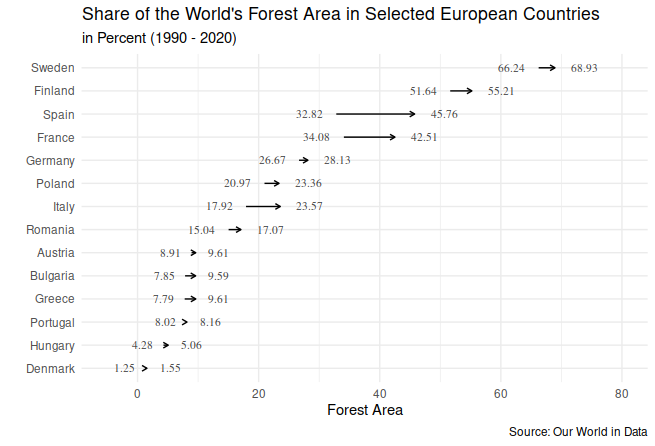

Week 15 was all about deforestation. The data I downloaded using the `tidytuesdayR` package came from Our World in Data. You can read more about the underlying article [here](https://ourworldindata.org/forests-and-deforestatio).

## Forest Area
This week I wanted to try to make a path plot in R. I chose the `forest_area` dataset from TidyTuesday's week 15 data set. The variable `forest_area` contains the share of the world's forests for each country. I chose the EU but had to filter out some countries due to a lack of data. Here is the finished visualization:

The hardest part about this was figuring out where to place the labels for each arrow and in what direction each arrow is supposed to point. 
At first sight, I was surprised that the share of the world's forest area increased in every selected country but looking at the numbers as well as the Our World in Data article suggested that this is what was happening. Keeping in mind that we are looking at the *share* of global forest area for every country, it is not that surprising after all. You can find the code [here](https://github.com/luziw/tidytuesday).

