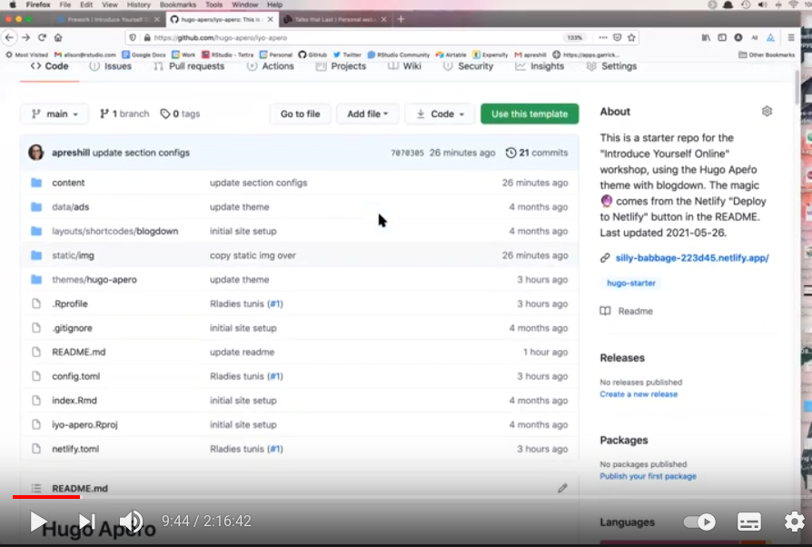

I built this site using Alison Hills' resources on github. I got started by following a workshop she hosted for Rladies tunis that I found on twitter. You can find the workshop by clicking on the image:

I have been curious about blogdown, Hugo and Netlify for a while now but I wasn't sure if I was ready but when I found this video on twitter, I just gave it a try. Following the workshop was pretty easy and I learned a lot! Check it out and introduce yourself online :)
